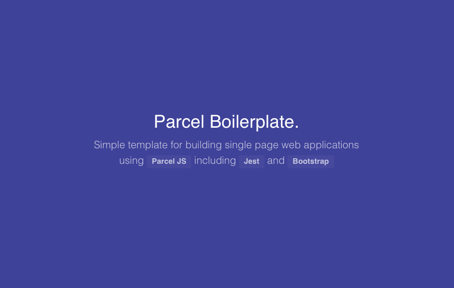

# Parcel Boilerplate

> Starter template for building single page web applications using *Parcel* 

 

## Default project structure

```bash
|
|-- dev  # development assets
|-- dist # production assets
...
|-- public/index.html
|-- src/styles/override.css
|-- src/app.js
|-- tests/app.spec.js
...
```

## Requirements

| Software                                                     | Version(s) |
| ------------------------------------------------------------ | ---------- |
| [Node](https://nodejs.org/en/download/current/)              | 17.6.0     |
| [npm](https://docs.npmjs.com/downloading-and-installing-node-js-and-npm) | 8.5.1      |
| [Parcel](https://parceljs.org/)                              | 1.12.3     |

## Installation

> Install *parcel* globally

```bash
$  npm i -g parcel
```

> Install project and depedencies

```bash
$ npm install
```

## Run

> Run dev server - http://localhost:1234

```bash
$ npm start
```

## Build

> Build for production in *dist* folder

```bash
$ npm run build
```

## Test

> Run tests with *Jest*

```bash
$ npm run test
```

